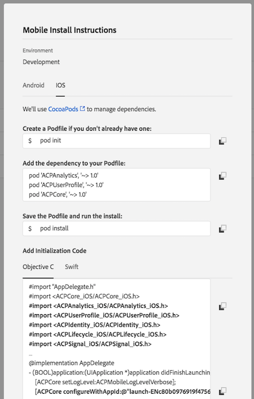

# Mobile

Creating a mobile property in Launch helps you seamlessly configure **Adobe Experience Cloud SDKs** for your mobile apps. Follow these simple steps to get started:

1. [Create and Publish configuration in Adobe Experience Platform Launch](mobile-1.md#create-and-deploy-configurations-in-adobe-launch)
    1. Create a new **Mobile** property
    2. Setup **Extensions**
    3. **Publish** configuration

2. [Implement Adobe Experience Platform SDKs in your apps](mobile-1.md#install-the-adobe-cloud-platform-sdks-in-an-android-or-ios-app)
    1. [Android](mobile-1.md#use-the-adobe-cloud-platform-sdks-in-an-android-app)
    2. [iOS](mobile-1.md#use-the-adobe-experience-cloud-platform-sdks-in-an-ios-app)
---
## 1. Create and publish configuration in Adobe Experience Platform Launch

1. Create a new **Mobile** property
   1. Click **New Property**. 
   2. Create a new property by providing a name and selecting **Mobile** as the platform. If required, you may change **Privacy** and **HTTPS** settings later.
   3. Find the new property in the Properties list and click to open it.

1. Setup **Extensions**
   1. Go to the **Extensions** tab.  _Note: Mobile Core and Profile extensions are installed by default._
   2. Click **Catalog**, and install all the extensions you need.
   _See: [What extensions do I need?](../extension-reference/mobile/)_
   _Note: Default configuration values for each extension are already set. See [Mobile Extensions](../extension-reference/mobile/) for more detail on extension configuration._
   
1. Go to the **Environments** tab.  _Note: Production, staging, and development environments have been created for your convenience._

3. Publish configuration
   In this step, you'll create library of changes and then deploy the library to a **Development Environment**.
   1. Go to the **Publishing** tab
   2. Click on **Add New Library** under the **Development** section of the publishing workflow.
   3. Specify a name for the library and select a development environment from the **Environment** dropdown.
   4. Add the configuration changes to be deployed.
   5. Click **Add All Changed Resources** \(or to add only some changes, click **Add a Resource**\).
   6. Click **Save & Build for Development**.
   _Note: The library will build and then show under the **Development** section of the publishing workflow._
   7. Click on the down arrow for the library and select **Submit for Approval**.
   
   The configuration contained in the library will then be deployed to the Development environment and the library will show under the Submitted section of the publishing workflow.

   Testing can be done using the configuration in the Development environment. Later, the library can be deployed to **Staging** and **Production Environments** using the rest of the publishing workflow. Please see (link-to publishing-to-stage/prod-here)   
---
## Implement Adobe Experience Platform SDKs

1. Open the **Mobile** property in Launch and go to the **Environments** tab to view instructions for adding the SDKs to an app.
2. Find the platform needed in the table and click on the box icon under the **Install** column.
3. On the **Mobile Install Instructions** pop-up, choose **Android** or **iOS**.
4. Follow the instructions for using Grade with Android or CocoaPods with iOS. The necessary dependecies and initialization code can be copied from the pop-up to the app project.

## Android

_**Important:** Adobe Experience Platform SDK for Android supports **Android 4.0 \(API 14\) or later.**_

1. Create MainActivity.java in the app.
2. Add `MobileCore.configureWithAppID("PASTE_APP_ID_HERE");`

## iOS

_**Important:** Adobe Experience Platform SDKs for iOS supports **iOS 10 or later.**_

1. In Xcode, open AppDelegate.swift (Swift) or AppDelegate.m (Objective-C)
2. Under `didFinishLaunchingWithOptions`, add:
    1.  _Swift:_`ADBMobileMarketing.configure(withAppId: "YOUR_APP_ID")` or
    2.  _Objective-C:_ `[ACPCore configureWithAppId:@"PASTE_APP_ID_HERE"];`. 
---

## Next Steps
### Setup Core functionality
1. [Setup debug logging]()
2. [Setup Experience Cloud Identity services]()
3. [Setup Lifecycle Metrics]()

### Setup Adobe Experience Cloud solutions
1. [Setup Adobe Analytics]()
2. [Setup Adobe Audience Manager]()
3. [Setup Adobe Target]()

---

## Further Reading
  * [Advanced configuration options](https://docs.adobelaunch.com/client-side-information/mobile/sdk-core/configuration-extension)
  * [How to use Gradle for Android](https://docs.gradle.org/current/userguide/userguide.html)
  * [How to use CocoaPods for iOS ](https://guides.cocoapods.org/using/using-cocoapods)
